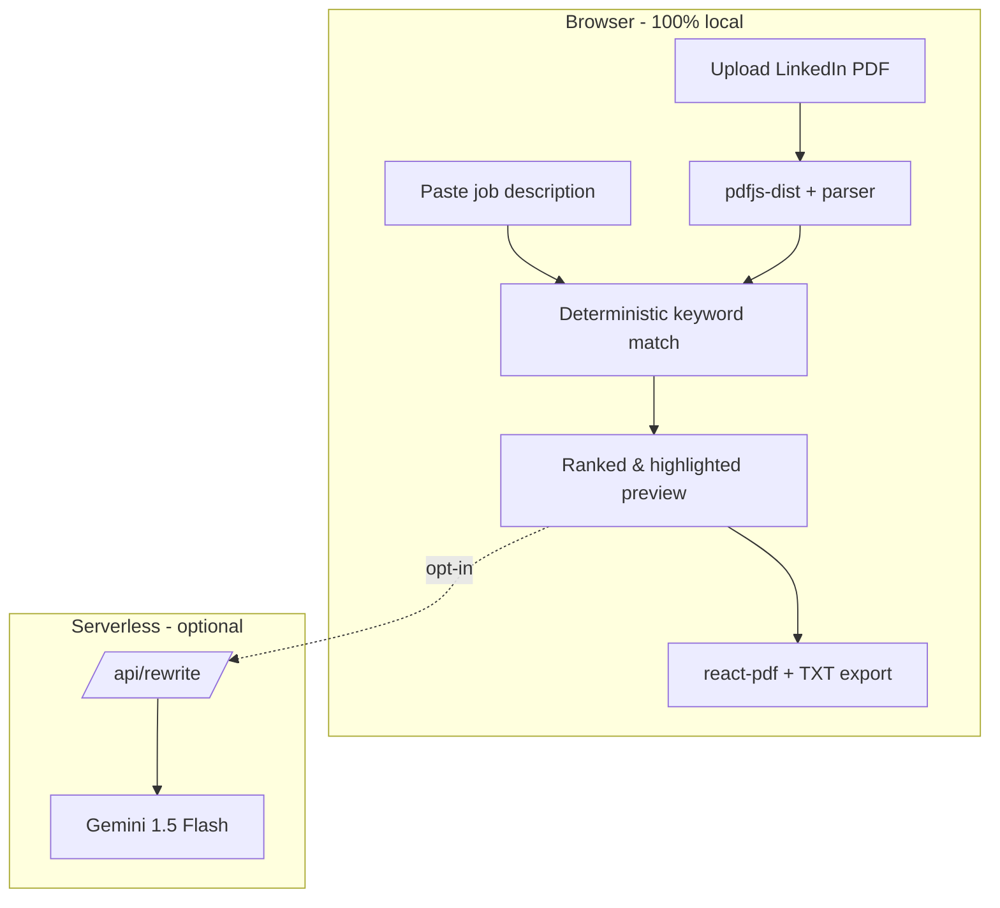

# hire-ready

Turn your raw experience into a hire-ready resume in seconds — **private, local,
and free**.

`hire-ready` is an open-source tool that tailors your resume and cover letter to
a specific job description. The heavy lifting (reading your LinkedIn PDF, keyword
matching, and generating the final PDF) happens **entirely in your browser**.
Your data never leaves your device unless you explicitly opt into the optional
AI refinement step.

## How it works

1. **Upload** your LinkedIn profile PDF (_Profile → More → Save to PDF_).
2. **Paste** the job description you're targeting.
3. **Add notes** (typed or dictated) and pick a tone.
4. **Download** a tailored resume and cover letter as TXT and PDF.



## Architecture

Two complementary modules:

- **Local analysis (no AI, deterministic).** Pure TypeScript extracts text from
  the PDF, tokenizes the job description, extracts and weights keywords
  (technologies, methodologies, soft skills), and ranks your experiences by
  relevance. Same input ⇒ same output, no network required.
- **Optional AI refinement (zero/low cost).** A Vercel Serverless Function acts
  as a secure proxy to Google **Gemini 1.5 Flash**, masking the API key and
  using the free tier to professionally rewrite your bullets. If it's not
  configured or fails, the app gracefully falls back to the deterministic text.

### Tech stack

| Concern        | Choice                                             |
| -------------- | -------------------------------------------------- |
| Framework      | Next.js 14 (App Router) + TypeScript               |
| Styling        | Tailwind CSS                                        |
| PDF reading    | `pdfjs-dist` (client-side)                          |
| PDF generation | `@react-pdf/renderer` (declarative templates)       |
| State          | Zustand                                            |
| Dictation      | Web Speech API (native, no dependency)             |
| AI proxy       | Vercel Serverless + `@google/generative-ai`        |

### Repository layout

```
app/
  page.tsx                 # 4-step wizard
  api/rewrite/route.ts     # secure Gemini proxy (serverless)
src/
  components/              # wizard steps + UI
  hooks/                   # useSpeechRecognition (dictation)
  lib/
    parsing/               # pdfExtractor, linkedinParser
    match/                 # tokenizer, keywordExtractor, scorer (pure)
    ai/                    # client, promptBuilder, rateLimit
    export/                # txtExporter, pdfExporter, download
    resume.ts              # builds the tailored ResumeModel
  store/                   # Zustand store
  templates/               # community PDF templates + registry
data/                      # stopwords (PT/EN) + skills dictionary
docs/                      # contribution guides
tests/                     # vitest unit tests
```

## Getting started

```bash
npm install
npm run dev
```

Open <http://localhost:3000>.

### Enabling the optional AI module

1. Get a free API key at <https://aistudio.google.com/app/apikey>.
2. Copy `.env.example` to `.env.local` and set `GEMINI_API_KEY`.
3. Restart the dev server. The "Refine with AI" button will now call Gemini via
   the serverless proxy. Without a key, the app stays fully functional using the
   deterministic output.

The key is only ever read server-side in [`app/api/rewrite/route.ts`](app/api/rewrite/route.ts);
it is never shipped to the browser.

## Scripts

| Command             | Description                          |
| ------------------- | ------------------------------------ |
| `npm run dev`       | Start the dev server                 |
| `npm run build`     | Production build                     |
| `npm run start`     | Run the production build             |
| `npm run lint`      | ESLint                               |
| `npm run typecheck` | TypeScript (`tsc --noEmit`)          |
| `npm test`          | Vitest unit tests                    |

> `predev`/`prebuild` automatically copy the pdf.js worker into `public/` so it
> is served locally (no third-party CDN).

## Deploying to Vercel

1. Import the repository in Vercel (framework preset: **Next.js**).
2. Add the `GEMINI_API_KEY` environment variable (optional) in Project Settings.
3. Deploy. The serverless proxy at `/api/rewrite` runs automatically.

## Contributing

We'd love your help, especially with:

- **New PDF templates** — see [docs/CONTRIBUTING_TEMPLATES.md](docs/CONTRIBUTING_TEMPLATES.md).
- **Better matching** (skills dictionary, scoring) — see [docs/CONTRIBUTING_MATCH.md](docs/CONTRIBUTING_MATCH.md).

Please run `npm run lint`, `npm run typecheck`, and `npm test` before opening a PR.

## Privacy

- The LinkedIn PDF is parsed in your browser; the file is never uploaded.
- Keyword matching and PDF/TXT generation are fully local.
- The **only** data that can leave your device is the resume bullets you choose
  to send when you click "Refine with AI", which go to our serverless proxy and
  on to Google Gemini.

## License

[MIT](LICENSE) © Iago Mendes
